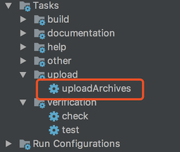
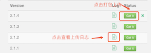
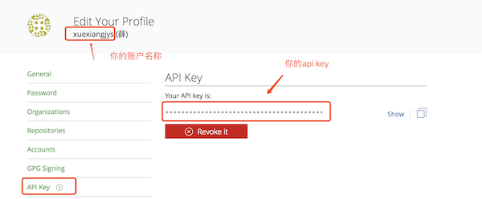
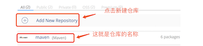
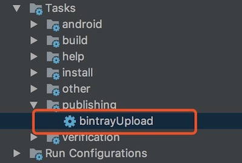
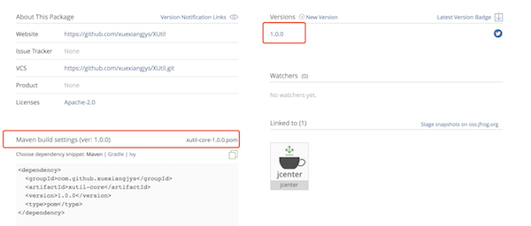

# 如何使用Gradle脚本上传代码仓库

---------------------------------

## 目录

* [上传本地代码仓库](#上传本地代码仓库)

* [上传JitPack](#上传jitpack)

* [上传Jcenter](#上传jcenter)

* [上传私有云Maven仓库](#上传私有云maven仓库)

---------------------------------

## 上传本地代码仓库

> 使用[localRepositoryUpload.gradle](./localRepositoryUpload.gradle)可以将代码打包上传至本地代码仓库，方便调试。这样我们可以现在本地仓库进行调试，待确认没问题了，可以上传云端代码仓库。

### 代码仓库配置

1.在Module的根目录下新建gradle.properties文件，然后配置如下属性：

```
GROUP=                            //组织名
POM_ARTIFACT_ID=                  //项目名
POM_VERSION=                      //版本名
```

依赖的时候配置如下：
```
compile 'GROUP:POM_ARTIFACT_ID:POM_VERSION'
```

2.在Module的build.gradle中添加gradle脚本引用。

```
apply from: "https://raw.githubusercontent.com/xuexiangjys/XUtil/master/localRepositoryUpload.gradle"
```

### 执行上传任务

执行上传任务有两种方式：

* 执行命令：`./gradlew uploadArchives`

* Gradle执行窗口: 点击Android Studio右侧的Gradle执行窗口，找到uploadArchives上传任务，点击执行。详情如下图：



---------------------------------

## 上传JitPack

> https://jitpack.io/ 是公网上一个非常方便的Maven仓库，基于GitHub进行代码仓库管理，无需复杂的配置，就可以非常方便地发布打包代码。

> 使用[JitPackUpload.gradle](./JitPackUpload.gradle)不仅可以将代码打包上传至JitPack代码仓库，还可以生成在线API文档。

### 代码仓库配置

1.先在项目根目录的 build.gradle 的 dependencies 添加插件依赖:

```
buildscript {
    dependencies {
        ...
        classpath 'com.github.dcendents:android-maven-gradle-plugin:2.0'
    }
}
```

2.在Module的build.gradle中添加gradle脚本引用。

```
apply from: "https://raw.githubusercontent.com/xuexiangjys/XUtil/master/JitPackUpload.gradle"

// 指定group，com.github.<用户名>，这里我默认填写的是我的github账号，请换成你自己的。
group='com.github.xuexiangjys'
```
【注意】：这里需要将`group`换成你的github账号

### 执行上传任务

> 需要注意的是，上传到JitPack一定要保证项目代码执行无误，否则将无法上传成功，这里你可以先通过[上传本地代码仓库](#上传本地代码仓库)，确保无误后再进行上传任务。

1.在将代码上传到JitPack之前，我们需要将其在GitHub上的项目打一个TAG,发布一个版本。因为JitPack是基于GitHub标签进行代码打包的。

2.登录[JitPack官网](https://jitpack.io/)，在页面左侧的Repositories选择你需要上传的项目，然后点击"Get it"进行打包上传。详情如下图：



### 在线文档

1.API在线文档的路径一般如下：
```
https://jitpack.io/com/github/User/Repo/Version/javadoc/
```
* User: 你的GitHub用户名
* Repo: 你的GitHub项目名
* Version: 你项目发布的版本

2.如果你的项目不止一个发布Module的话，API在线文档的路径会多出一个module名
```
https://jitpack.io/com/github/User/Repo/Module/Version/javadoc/
```
* module: 你的Module名

---------------------------------

## 上传Jcenter

> https://jcenter.bintray.com 是由JFrog公司提供的Bintray中的Java仓库。它是当前世界上最大的Java和Android开源软件构件仓库。

与JitPack相比，他功能更多，也更复杂。当然上传也同样比较复杂，如果你是新手的话，我不推荐你使用这种。

### 代码仓库配置

1.先在项目根目录的 build.gradle 的 dependencies 添加插件依赖:

```
buildscript {
    dependencies {
        ...
        classpath 'com.github.dcendents:android-maven-gradle-plugin:2.0'
        classpath 'com.jfrog.bintray.gradle:gradle-bintray-plugin:1.8.0'
    }
}
```

2.在项目根目录的 local.properties 进行如下用户信息配置：

```
#bintray
bintray.user=               //bintray上的用户名
bintray.apikey=             //bintray上的apikey，每一个用户唯一识别码

#developer
developer.id=               //开发者id，可随便填，只是描述信息
developer.name=             //开发者姓名
developer.email=            //开发者的联系邮箱
```

【注意】：`bintray.user`和`bintray.apikey`需要你在 https://bintray.com/ 上注册后才能获得。详情如下图：



3.在Module的根目录下新建gradle.properties文件，然后配置如下属性：

下面我就以我的开源库[XUtil](https://github.com/xuexiangjys/XUtil)举例说明。

```
#project dependency info
project.groupId=com.github.xuexiangjys          //组名
project.artifactId=xutil-core                   //项目名
project.version=1.0.0                           //版本名

#project description
project.name=XUtil                             //项目名称
project.bintrayRepository=maven                //仓库名称
project.packaging=aar                          //打包类型
project.siteUrl=https://github.com/xuexiangjys/XUtil      //项目托管地址
project.gitUrl=https://github.com/xuexiangjys/XUtil.git   //项目git地址

#javadoc
javadoc.name=XUtil

```

【注意】：这里`project.bintrayRepository`需要你在 https://bintray.com/ 上创建用户账号后，手动新建一个代码仓库。它是你新建的代码仓库的名称。详情如下图：



4.在Module的build.gradle中添加gradle脚本引用。

```
apply from: https://raw.githubusercontent.com/xuexiangjys/XUtil/master/bintrayUpload.gradle
```

### 执行上传任务

执行上传任务有两种方式：

* 先后执行命令：`./gradlew install`和`./gradlew bintrayUpload`

* Gradle执行窗口: 点击Android Studio右侧的Gradle执行窗口，找到bintrayUpload上传任务，点击执行。详情如下图：



上传任务完成后，可登录 https://bintray.com/ 到你上传的仓库里看项目是否存在，如果存在则点击进入项目主页查看是否有你刚才上传的版本信息，如果有则上传成功，否则上传失败。详情如下图：



### 提交Jcenter

上传完毕后，并不代表你已经完成任务了。最后，你还需要点击项目页面右下角的"Add to JCenter",填写提交信息后，等待JCenter审核通过后才算完成上传Jcenter。

审核大概需要几个小时，这个比较蛋疼，但也没办法。

---------------------------------

## 上传私有云Maven仓库

> 当我们对代码的保密性比较强时，我们可能会自己搭建一个私有的Maven仓库，搭建的详细步骤可[点击查看](https://blog.csdn.net/qq_32452623/article/details/79385595)

### 代码仓库配置

1.在Module的根目录下新建gradle.properties文件，然后配置如下属性：

```
#上传构件的信息
GROUP=                            //组织名
ARTIFACT_ID=                      //项目名
VERSION_NAME=                     //版本名

#上传的目标仓库地址
SNAPSHOT_REPOSITORY_URL=
RELEASE_REPOSITORY_URL=

#Nexus 的私服的用户名称和密码
NEXUS_USERNAME=
NEXUS_PASSWORD=
```
如果你发布的是snapshot版本，那么你需要在`VERSION_NAME`中包含`SNAPSHOT`, 例如"1.0.0-SNAPSHOT"。版本名不带`SNAPSHOT`的默认都是release版本。

2.在Module的build.gradle中添加gradle脚本引用。

```
apply from: "https://raw.githubusercontent.com/xuexiangjys/XUtil/master/upload_nexus.gradle"
```

### 执行上传任务

执行上传任务有两种方式：

* 执行命令：`./gradlew uploadArchives`

* Gradle执行窗口: 点击Android Studio右侧的Gradle执行窗口，找到uploadArchives上传任务，点击执行。详情如下图：

